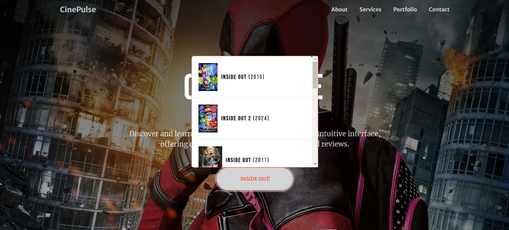
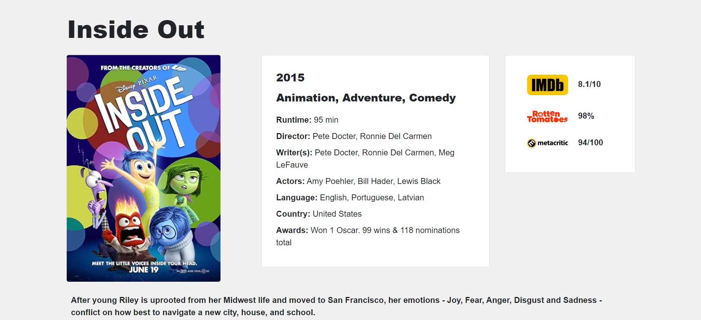

# CinePulse

**CinePulse** is a web application designed to help users discover and explore movies. It utilizes the OMDb API to provide detailed movie information and dynamic visuals, and now includes YouTube API integration for movie trailers.

## Features

- **Search Suggestions**: Real-time movie suggestions with images as you type.
- **Detailed Movie Information**: Includes movie posters, ratings, and comprehensive details.
- **Dynamic UI**: Responsive and user-friendly interface for an enhanced browsing experience.

## Screenshots

Here’s a glimpse of the application:

*Search Suggestions Screen*

*Movie Details Screen*

## Usage

To use the application:

1. Clone the repository: `git clone <repo-url>`
2. Navigate to the project directory: `cd cinepulse-app`
3. Open `index.html` in your browser to view the application.
4. Type a movie name in the search bar.
5. View real-time suggestions and select a movie to see detailed information.

## Technologies Used

- **JavaScript**: For dynamic functionality and API integration.
- **Bootstrap**: For responsive design.
- **OMDb API**: For fetching movie data.
- **YouTube Data API**: For embedding movie trailers.

## Current Status

**In Development**: The project is actively being developed with ongoing updates and feature additions. The application now includes real-time search suggestions and detailed movie information. Further improvements are underway.

## License

This project is licensed under the MIT License.
