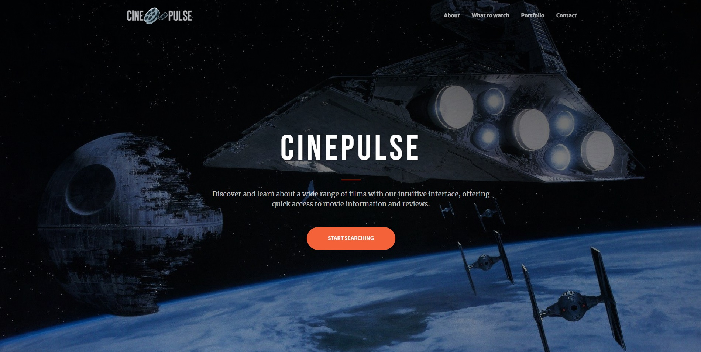
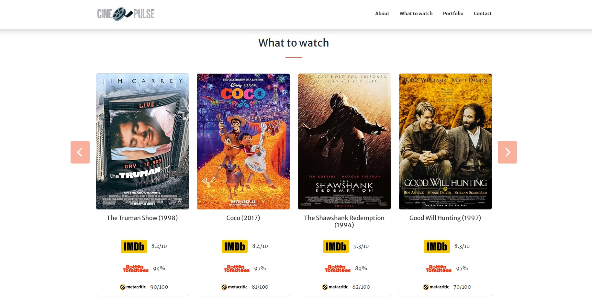

# CinePulse

**CinePulse** is a web application designed to help users discover and explore movies. It utilizes the OMDb API to provide detailed movie information, integrates the YouTube Data API to display movie trailers, and features a dynamic homepage with a carousel of movie suggestions and ratings from popular review sites.

## Live Demo

You can view the live version of CinePulse [here](https://cinepulseapp.netlify.app/).

## Features

- **Dynamic Homepage**: Displays movie suggestions and ratings based on data from popular review sites.
- **Search Suggestions**: Real-time movie suggestions with images as you type.
- **Detailed Movie Information**: Includes movie posters, ratings, and comprehensive details.
- **YouTube Trailers**: Show trailers for movies directly on the movie info page.
- **Dynamic UI**: Responsive and user-friendly interface for an enhanced browsing experience.
- **Contact Section**: Provides contact details and social media links.

## Screenshots

Here’s a glimpse of the application:

*Homepage*

*Search Suggestions Screen*

*Search Carousel Screen*

*Movie Details Screen*

## Usage

To use the application:

1. Clone the repository: `git clone <repo-url>`
2. Navigate to the project directory: `cd cinepulse-app`
3. Open `index.html` in your browser to view the application.
4. Type a movie name in the search bar.
5. View real-time suggestions and select a movie to see detailed information.

## Technologies Used

- **JavaScript**: For dynamic functionality and API integration.
- **Bootstrap**: For responsive design.
- **OMDb API**: For fetching movie data.
- **YouTube Data API**: For embedding movie trailers.
- **Font Awesome**: For icons and visual elements.

## Current Status

**In Development**: The project is actively being developed with ongoing updates and feature additions. The application now includes movie trailers and a new 'What to watch' homepage section with a carousel of movie suggestions. Further improvements are underway.

## License

This project is licensed under the MIT License.
