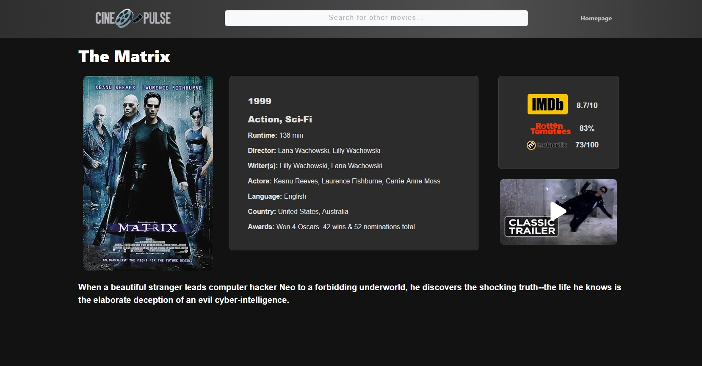

# CinePulse

**CinePulse** is a web application designed to help users discover and explore movies. It utilizes the OMDb API to provide detailed movie information and dynamic visuals.

## Features

- **Search Suggestions**: Real-time movie suggestions with images as you type.
- **Detailed Movie Information**: Includes movie posters, ratings, and comprehensive details.
- **Dynamic UI**: Responsive and user-friendly interface for an enhanced browsing experience.

## Screenshots

Here’s a glimpse of the application:

*Search Suggestions Screen*

*Movie Details Screen*

## Usage

To use the application:

1. Type a movie name in the search bar.
2. View real-time suggestions and select a movie to see detailed information.

## Technologies Used

- **OMDb API**: For fetching movie data.
- **Bootstrap**: For responsive design.

## Current Status

**In Development**: The project is actively being developed with ongoing updates and feature additions. The application now includes real-time search suggestions and detailed movie information. Further improvements are underway.

## License

This project is licensed under the MIT License.
